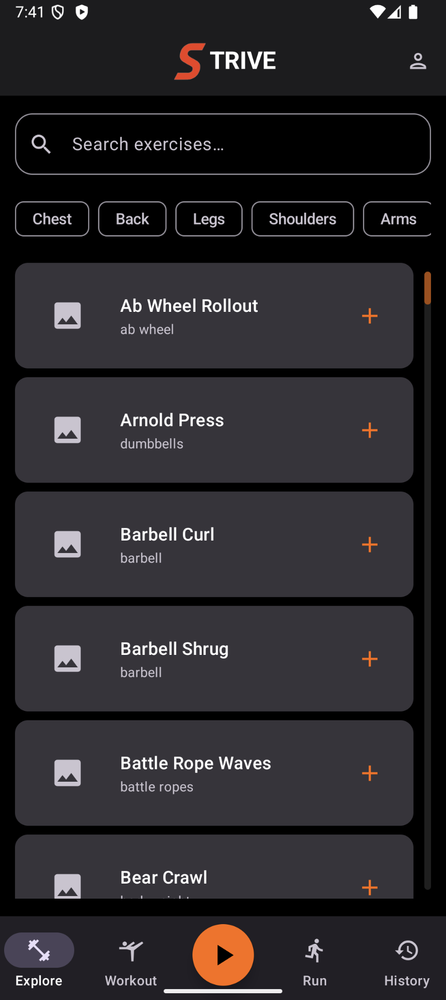
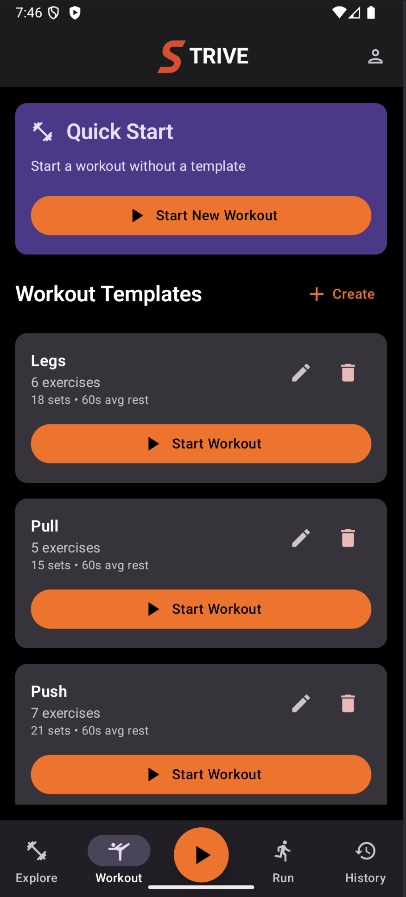
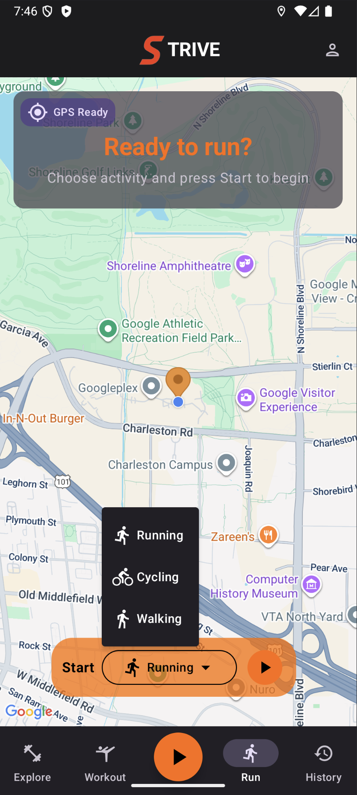
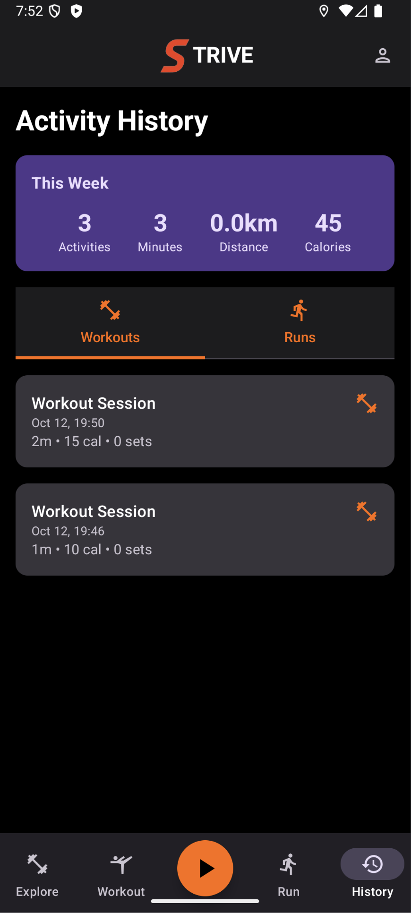

<div align="center">

# 💪 Strive

### *Your Personal Fitness Companion*

**Take control of your fitness journey** with Strive – a modern Android application that helps you reach your goals, step by step.

[](https://www.android.com/)
[](https://kotlinlang.org/)
[](https://developer.android.com/jetpack/compose)
[](https://developer.android.com/about/versions/pie)
[](LICENSE)

[Features](#-features) • [Screenshots](#-screenshots) • [Tech Stack](#-tech-stack) • [Getting Started](#-getting-started) • [Architecture](#-architecture) • [License](#-license)

</div>

---

## 📖 About

Strive is a comprehensive fitness tracking application built with modern Android development practices. Whether you're hitting the gym or going for a run, Strive helps you plan, track, and analyze your workouts with an intuitive interface and powerful features.

Built entirely with **Kotlin** and **Jetpack Compose**, Strive demonstrates clean architecture, modern UI design, and seamless integration with Google services.

---

## ✨ Features

<table>
<tr>
<td width="50%">

### 🏋️‍♀️ **Exercise Library**
- 📚 Browse 200+ exercises with instructions
- 🔍 Smart search by name or body part
- 🖼️ Visual demonstrations
- 📴 Works 100% offline

</td>
<td width="50%">

### 💪 **Workout Planning**
- 📝 Create custom workout templates
- ⚙️ Configure sets, reps, and rest times
- 🎯 Quick workout mode
- 🔄 Drag-and-drop exercise reordering

</td>
</tr>
<tr>
<td width="50%">

### ⏱️ **Live Tracking**
- ⏰ Smart countdown timers
- 📊 Real-time progress tracking
- 🏋️ Weight progression memory
- 🔥 Automatic calorie estimation

</td>
<td width="50%">

### 🏃 **GPS Run Tracking**
- 🗺️ Live map with Google Maps
- 📍 Real-time GPS tracking
- 📈 Distance, pace, and time
- 🛣️ Route visualization

</td>
</tr>
<tr>
<td width="50%">

### 📊 **History & Stats**
- 📅 Complete workout history
- 📈 Progress charts
- 🔍 Filter by activity type
- 💾 Export capabilities

</td>
<td width="50%">

### 🎨 **Modern UI/UX**
- 🌙 Material 3 Design
- 📱 Responsive layouts
- 🔄 Portrait & landscape support
- ⚡ Smooth animations

</td>
</tr>
</table>

---

## 📸 Screenshots

<div align="center">

<table>
<tr>
<td width="25%">

<p align="center"><b>Exercise Library</b><br/>Browse & search exercises</p>
</td>
<td width="25%">

<p align="center"><b>Workout Templates</b><br/>Create custom workouts</p>
</td>
<td width="25%">

<p align="center"><b>GPS Tracking</b><br/>Live map & stats</p>
</td>
<td width="25%">

<p align="center"><b>Activity History</b><br/>Track your progress</p>
</td>
</tr>
</table>

</div>

---

## 🛠️ Tech Stack

### **Core Technologies**

<p align="center">
  
  
  
</p>

### **Architecture & Patterns**
- 🏗️ **Clean Architecture** - Separation of concerns across layers
- 🎯 **MVVM Pattern** - Reactive UI with ViewModel and StateFlow
- 💉 **Dependency Injection** - Dagger Hilt for modular dependencies
- 🔄 **Reactive Programming** - Kotlin Flow for reactive data streams

### **Libraries & Frameworks**

| Category | Technology |
|:---------|:-----------|
| 🎨 **UI** | Jetpack Compose, Material 3, Coil (image loading) |
| 💾 **Database** | Room (SQLite ORM with Flow support) |
| 🌐 **Network** | Retrofit, OkHttp, Kotlinx Serialization |
| 🗺️ **Maps** | Google Maps SDK, Location Services |
| 💉 **DI** | Dagger Hilt |
| 💿 **Preferences** | DataStore |
| 🔒 **Security** | R8 Code Shrinking & Obfuscation |

### **Architecture Diagram**

```
┌─────────────────────────────────────────────────────┐
│                   UI Layer                          │
│          Jetpack Compose + ViewModels               │
│              (Screens, Components)                  │
└───────────────────┬─────────────────────────────────┘
                    │ StateFlow/Events
┌───────────────────▼─────────────────────────────────┐
│                Domain Layer                         │
│         Use Cases + Repository Interfaces           │
│              (Business Logic)                       │
└───────────────────┬─────────────────────────────────┘
                    │ Models
┌───────────────────▼─────────────────────────────────┐
│                 Data Layer                          │
│      Room Database + Retrofit API + Mappers         │
│         (Local & Remote Data Sources)               │
└─────────────────────────────────────────────────────┘
```

---

## 🚀 Getting Started

### Prerequisites

Before you begin, ensure you have the following installed:

- ✅ **Android Studio** Hedgehog (2023.1.1) or later
- ✅ **JDK** 11 or higher
- ✅ **Android SDK** 28+ (Android 9.0 Pie)
- ✅ **Google Play Services** (for Maps & Location)

### Installation

1. **Clone the repository**
   ```bash
   git clone https://github.com/yourusername/strive.git
   cd strive
   ```

2. **Open in Android Studio**
   - Launch Android Studio
   - Select "Open an Existing Project"
   - Navigate to the cloned directory

3. **Configure API Keys**

   Create a `local.properties` file in the project root (if it doesn't exist) and add:

   ```properties
   # Google Maps API Key (Required for Run screen)
   MAPS_API_KEY=your_google_maps_api_key_here
   
   # ExerciseDB API Key (Optional - app works offline without it)
   RAPIDAPI_KEY=your_rapidapi_key_here
   ```

   > 💡 **Getting API Keys:**
   > - **Google Maps**: [Get API Key](https://console.cloud.google.com/) - Enable "Maps SDK for Android"
   > - **ExerciseDB**: [RapidAPI](https://rapidapi.com/justin-WFnsXH_t6/api/exercisedb) - Free tier available

4. **Sync & Build**
   ```
   File → Sync Project with Gradle Files
   ```

5. **Run the app** 🚀
   - Connect an Android device or start an emulator
   - Click the "Run" button or press `Shift + F10`

---

## 📱 Usage

### First Launch
- The app will automatically seed the exercise database on first launch
- No account or login required
- All data is stored locally on your device

### Creating a Workout
1. Navigate to **Workout** tab
2. Tap **"Create Template"**
3. Add exercises from the library
4. Configure sets, reps, and rest times
5. Save and start your workout!

### Tracking a Run
1. Navigate to **Run** tab
2. Select activity type (Running, Cycling, Walking)
3. Grant location permissions when prompted
4. Tap **"Start"** and begin your activity
5. View real-time stats and route on the map

---

## 🏗️ Architecture

Strive follows **Clean Architecture** principles with clear separation between layers:

### Modules

```
📦 app
 ┣ 📂 core              → Cross-cutting concerns (DI, Utils, Location)
 ┣ 📂 data              → Data sources (Room, Retrofit, Repositories)
 ┣ 📂 domain            → Business logic (Models, Use Cases)
 ┗ 📂 ui                → Presentation (Compose Screens, ViewModels)
```

### Key Principles
- ✅ **Single Responsibility** - Each class has one job
- ✅ **Dependency Inversion** - Depend on abstractions, not concretions
- ✅ **Separation of Concerns** - UI, Business Logic, and Data are independent
- ✅ **Testability** - All components are easily testable

---

## 🔒 Security & Privacy

- 🔐 **No User Accounts** - All data stored locally
- 🚫 **No Data Collection** - Your fitness data stays on your device
- 🔑 **API Key Protection** - Keys stored securely in build configuration
- 🛡️ **R8 Obfuscation** - Code protected against reverse engineering
- 🔒 **HTTPS Only** - All network communication is encrypted

---

## 🤝 Contributing

This project was created as an academic assignment. While it's not actively seeking contributions, feel free to:

- 🐛 Report bugs by opening an issue
- 💡 Suggest features or improvements
- 🍴 Fork the project for your own experiments

It's still under development and may evolve over time.

### Development Setup

If you want to contribute or experiment:

1. Fork the repository
2. Create a feature branch (`git checkout -b feature/AmazingFeature`)
3. Commit your changes (`git commit -m 'Add some AmazingFeature'`)
4. Push to the branch (`git push origin feature/AmazingFeature`)
5. Open a Pull Request

---

## 📝 License

This project is licensed under the **MIT License** - see the [LICENSE](LICENSE) file for details.

### What this means:
- ✅ **Commercial use** - You can use this code in commercial projects
- ✅ **Modification** - You can modify the code
- ✅ **Distribution** - You can distribute the code
- ✅ **Private use** - You can use the code privately
- ⚠️ **Liability** - The software is provided "as is"
- ⚠️ **Warranty** - No warranty is provided

### Attribution

If you use this project, attribution is appreciated but not required:

```
Strive - Fitness Tracking App
Original Author: Carl Lundholm
GitHub: https://github.com/Carlsmeister/strive
```

---

## 👨‍💻 Author

<div align="center">

**Carl Lundholm**

[](https://github.com/Carlsmeister)
[](https://linkedin.com/in/carl-lundholm)
[](mailto:carl_0221@hotmail.se)

🎓 **Umeå University** | 5DV209 - Mobile Application Development  
📅 Academic Year Summer 2025

</div>

---

## 🙏 Acknowledgments

Special thanks to:

- 🏋️ **[ExerciseDB](https://rapidapi.com/justin-WFnsXH_t6/api/exercisedb)** - Comprehensive exercise database
- 🗺️ **[Google Maps Platform](https://developers.google.com/maps)** - Maps and location services
- 🎨 **[Material Design](https://m3.material.io/)** - Design system and guidelines
- 🤖 **[Android Open Source Project](https://source.android.com/)** - Android framework
- 🟣 **[Kotlin](https://kotlinlang.org/)** - Modern programming language
- 📚 **Umeå University** - Course instruction and guidance

---

## 📞 Support

If you encounter any issues or have questions:

1. 🐛 Search [existing issues](https://github.com/Carlsmeister/strive/issues)
2. 💬 Open a [new issue](https://github.com/Carlsmeister/strive/issues/new)

---

## 🗺️ Roadmap

Future improvements planned:

- [ ] ☀️ Light theme support
- [ ] 📊 Advanced statistics and charts
- [ ] 🏆 Achievement system
- [ ] 📤 Workout sharing with friends
- [ ] ⌚ Android Wear integration
- [ ] 📱 Widget support
- [ ] 🌐 Multi-language support
- [ ] ☁️ Optional cloud backup

---

## ⭐ Show Your Support

If you found this project helpful or interesting, please consider:

- ⭐ **Starring** the repository
- 🍴 **Forking** for your own experiments
- 📢 **Sharing** with others

---

<div align="center">

### Built with ❤️ using Jetpack Compose

**[⬆ Back to Top](#-strive)**

---

*© 2025 Carl Lundholm. All rights reserved.*

</div>
